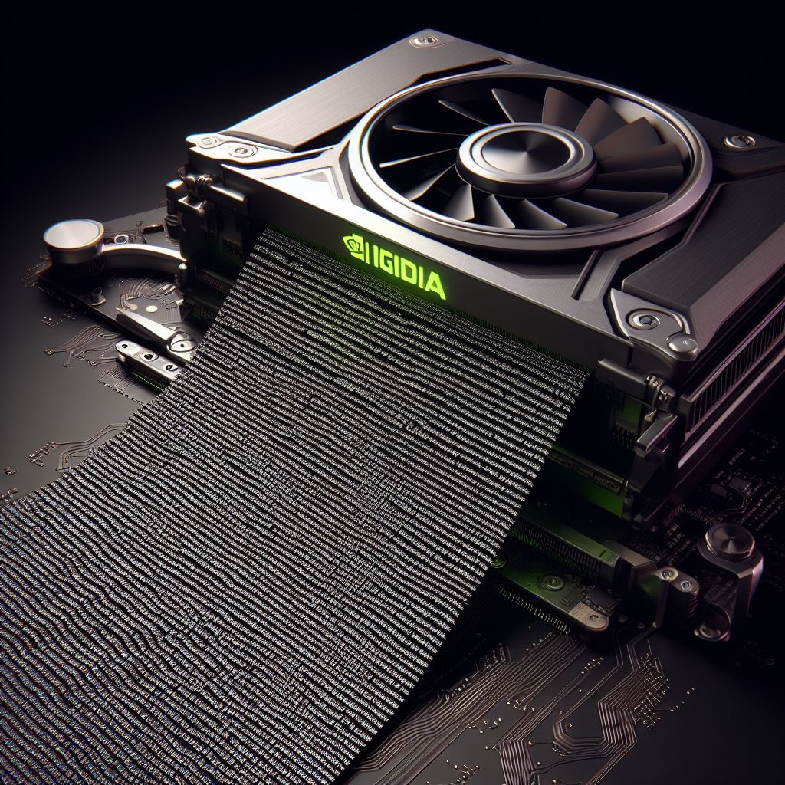

# cuda-1brc

The solution takes **16.8 seconds** to process one billion rows. 
This is a **60X** speedup over a pure C++ baseline in `base.cpp`.

Check out `fast.cu` to see how I do it. 
Read the [blog](https://tspeterkim.github.io/posts/cuda-1brc) for a detailed explanation.